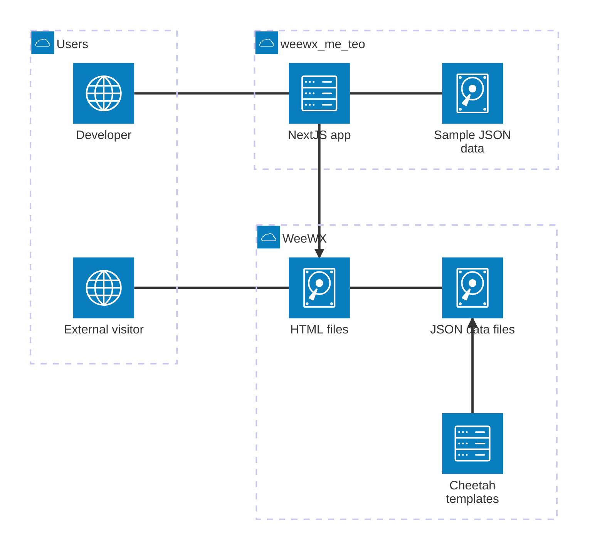

# Contributing to weewx-me.teo

First off, thank you for considering contributing to weewx-me.teo! Contributions from the community are essential in
making this project better. Whether you want to report a bug, propose new features, improve documentation, add
translations, or submit code changes, I welcome your input and assistance. This guide will help you get started with
contributing.

## Development Environment

This is a [Next.js](https://nextjs.org) project bootstrapped with
[`create-next-app`](https://nextjs.org/docs/app/api-reference/cli/create-next-app).

### Getting Started

First, install the dependencies:

```bash
npm install
```

Then, run the development server:

```bash
npm run dev
```

Then, open [http://localhost:3000](http://localhost:3000) with your browser to see the result.

### Data Flow

- The skin uses a hybrid approach combining static generation and client-side updates
- The NextJS app is pre-compiled and served as a static site
- Weather data is generated by the WeeWX report engine in the `data/*.json` files
- These JSON files are fetched by the client-side app, reloaded automatically every minute
- When running the development server, the skin will use sample data from the `public/sample_data` directory.

### Architecture Diagram



### NextJS

To learn more about Next.js, take a look at the following resources:

- [Next.js Documentation](https://nextjs.org/docs) - learn about Next.js features and API.
- [Learn Next.js](https://nextjs.org/learn) - an interactive Next.js tutorial.

You can check out [the Next.js GitHub repository](https://github.com/vercel/next.js) - your feedback and contributions
are welcome!

## Adding New Languages

1. [Fork](https://github.com/bourquep/weewx-me.teo/fork) this repository
2. Create a new code translation file in `messages/xx.json`
3. Copy the template from `en.json`
4. Translate all strings
5. Create a new skin translation file in `weewx/skins/me.teo/lang/xx.json`
6. Copy the template from `en.json`
7. Translate all strings
8. Add the language code to:
   - the `build-locale` language matrix in `.github/workflows/ci.yml`
   - the `CopyGenerator.copy_once` list in `weewx/skins/me.teo/skin.conf`
   - the `dayjs/locale` imports in `src/contexts/MUILocalizationProvider.tsx`
9. Add the language to the list of supported languages in `README.md`
10. Submit a pull request and be a hero!

## Submitting Pull Requests

### Conventional Commits

This repository uses [conventional commits](https://www.conventionalcommits.org/en/v1.0.0/). This means that each commit
message must follow a specific format. The format is as follows:

```
<type>[optional scope]: <description>
```

The `type` must be one of the following:

| Type       | Description                                                                        |
| ---------- | ---------------------------------------------------------------------------------- |
| `feat`     | A new feature.                                                                     |
| `fix`      | A bug fix.                                                                         |
| `docs`     | Documentation only changes.                                                        |
| `perf`     | A code change that improves performance.                                           |
| `refactor` | A code change that neither fixes a bug nor adds a feature.                         |
| `style`    | Changes that do not affect the meaning of the code (white-space, formatting, etc). |
| `chore`    | Regular maintenance tasks and updates.                                             |
| `build`    | Changes that affect the build system or external dependencies.                     |
| `ci`       | Changes to CI configuration files and scripts.                                     |
| `revert`   | Reverting a previous commit.                                                       |

The `scope` is optional and should be used to specify the part of the codebase that the commit affects.

The `description` should be a short, concise summary of the changes made in the commit. The description will appear
as-is in the release notes, so make sure it is clear, informative and not too technical.

For example:

```
feat: Added support for dark mode
```

### Semantic Versioning

This repository uses [semantic versioning](https://semver.org/). This means that each release will be versioned
according to the following rules:

- Increment the major version for breaking changes
- Increment the minor version for new features
- Increment the patch version for bug fixes

Releases are automatically generated by [semantic-release](https://github.com/semantic-release/semantic-release) based
on the commit messages. The version number is determined by the type of commits since the last release.

### Code Style

This repository uses [ESLint](https://eslint.org/) and [Prettier](https://prettier.io/) to enforce code style and
formatting. Please make sure that your code follows the linting rules and conventions used in the project.

### Pull Request Checklist

Before submitting a pull request, please make sure that:

- Your code follows the coding standards and conventions used in the project
- The documentation has been updated to reflect any changes
- Your commit messages follow the conventional commits format
- Your changes do not introduce any new linting errors or warnings
